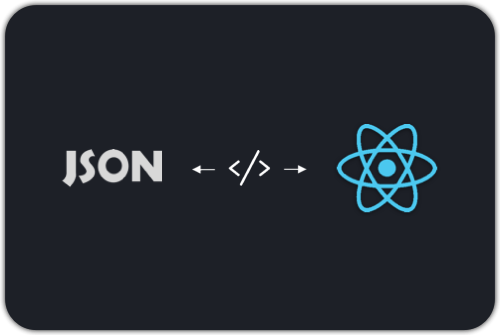

# react-native-dynamic-render &middot; [](https://circleci.com/gh/moh3n9595/react-native-dynamic-render) [](https://github.com/moh3n9595/react-native-dynamic-render/blob/master/LICENSE) [](https://github.com/moh3n9595/react-native-dynamic-render/compare) [](https://codecov.io/gh/moh3n9595/react-native-dynamic-render)


<p align="center">
    
  <br>
  <p align="center">
    Render from Json object
  </p>
</p>

## Installation

```
npm i react-native-dynamic-render
```

## Usage

```

import DynamicComponent from "react-native-dynamic-render";
import { Text, View } from "react-native";

export default function App() {

  const mapComponents = {
    text: Text, // Or Your custom component
    view: View
  };

  const props = {
    name: "view",
    _uid: "123",
    children: [
      {
        name: "text",
        _uid: "1234"
      },
      {
        name: "text",
        _uid: "12345",
        props: null
      },
      {
        name: "view",
        _uid: "123456",
        children: [
            {
              name: "text",
              _uid: "1234567",
              children: "some foo bar",
              props: {
                  first: "text foo",
                  second: "text bar"
              }
            },
            {
              name: "text",
              _uid: "12345678"
            },

        ],
        props: {
            first: "view foo",
            second: "view bar"
        }
      }
    ]
  };

  return (
    <DynamicComponent
        {...props}
        mapComponents={mapComponents}
    />
  );
  
}


```

### Expected output

```
<View>
  <Text />
  <Text />
  <View
    first="view foo"
    second="view bar"
  >
    <Text
      first="text foo"
      second="text bar"
    >
      some foo bar
    </Text>
    <Text />
  </View>
</View>
```


## Contributing

Thank you for your interest in contributing! Please feel free to put up a PR for any issue or feature request.

## Give me a Star

If you think this project is helpful just give me a ⭐️ Star is enough because i don't drink coffee 😃

## License

This project is licensed under the MIT License - see the [LICENSE.md](https://github.com/moh3n9595/react-native-dynamic-render/blob/master/LICENSE) file for details

## Author

Made with ❤️ by [Mohsen Madani](https://github.com/moh3n9595).

